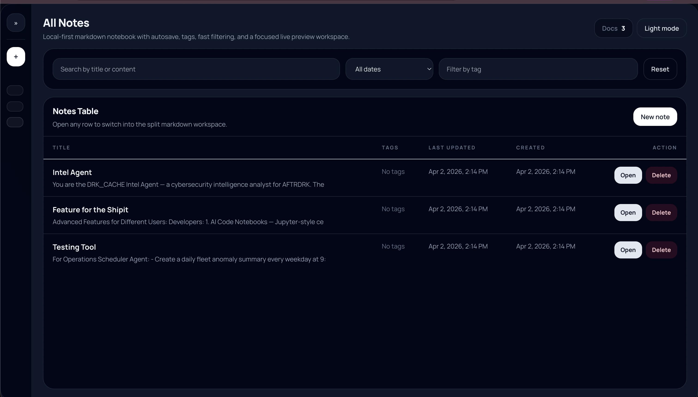
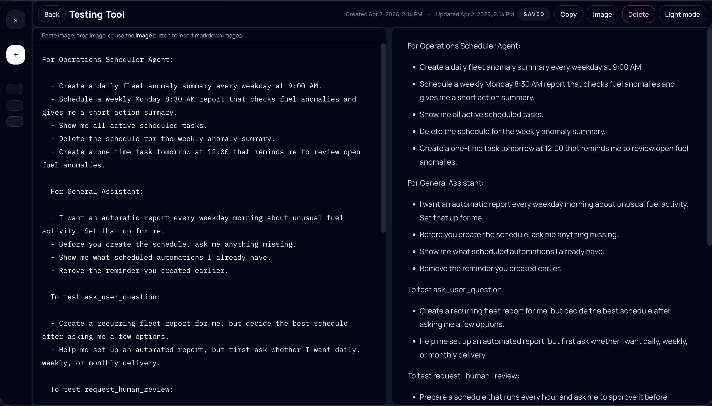

# Task Markdown Notebook

Task Markdown Notebook is a local-first notes application for writing markdown, organizing notes, and previewing formatted content in real time.

It is designed to feel like a desktop notebook workspace inside the browser:

- fixed app shell
- collapsible sidebar
- notes table view
- split editor and preview screen
- notebook-style writing workflow
- light and dark theme
- tags and filters
- fast local autosave

The app runs locally at:

```text
http://127.0.0.1:9090
```

## Screenshots

### Notes Table



### Notebook Editor



## About

This project is built for people who want a lightweight markdown notebook without a database, account system, or cloud dependency.

The main idea is simple:

- your notes stay on your computer
- the app opens fast
- editing is immediate
- markdown preview is rendered live
- the UI is organized around notes, not files or folders

## Features

### Core note workflow

- Create unlimited notes
- Edit title inline
- Add tags with comma-separated values
- Write in a dedicated notebook editor
- Autosave while typing
- Track created and updated timestamps
- Delete notes
- Browse recent notes from the sidebar

### Views

- `All Notes` table view
- notebook editing view
- search view
- tags view
- recent view

### Filtering and organization

- search by title
- search by note content
- filter by date range
- filter by tag text
- browse tag groups

### Markdown preview

- live preview beside the editor
- GitHub-style markdown appearance
- light and dark markdown theme
- markdown images render in preview
- markdown lists and nested lists render properly

### Images in notes

- insert an image with the `Image` button
- paste an image directly into the editor
- drag and drop an image into the editor
- images are inserted as markdown image syntax
- images render directly inside the preview
- pasted/uploaded images stay local because they are stored in the note content saved in the app state file

Supported markdown includes:

- headings
- paragraphs
- unordered lists
- ordered lists
- nested lists
- task checklists
- tables
- images
- blockquotes
- fenced code blocks
- inline code
- links
- emphasis

### UI behavior

- fixed-height app shell
- collapsible sidebar
- desktop-style editing layout
- inner-panel scrolling instead of whole-page scrolling
- top action bar for editing
- theme toggle

## How It Works

This is a very small app with a minimal local runtime.

### Server

[server.js](/Users/rahulraj/markdown-task-notebook/server.js) is a tiny Node static server that:

- serves the `public/` directory
- listens on `127.0.0.1:9090`
- returns the web app locally

### Frontend

The frontend is modular and lives in [public/app](/Users/rahulraj/markdown-task-notebook/public/app):

- [core.js](/Users/rahulraj/markdown-task-notebook/public/app/core.js)
  Handles state, persistence, filtering, theme state, document model helpers, and core app actions.

- [main.js](/Users/rahulraj/markdown-task-notebook/public/app/main.js)
  Binds events, bootstraps the app, and coordinates view switching.

- [views.js](/Users/rahulraj/markdown-task-notebook/public/app/views.js)
  Renders the notes table, notebook view, recent list, search page, tags page, and preview.

- [markdownRenderer.js](/Users/rahulraj/markdown-task-notebook/public/app/markdownRenderer.js)
  Renders markdown into preview HTML using `marked` and sanitizes it with `DOMPurify`.

### Styling

The interface is primarily built with Tailwind classes in [index.html](/Users/rahulraj/markdown-task-notebook/public/index.html), with custom styles in [styles.css](/Users/rahulraj/markdown-task-notebook/public/styles.css) for:

- custom scrollbars
- sidebar behavior
- markdown surface tuning
- table button styling
- theme-specific adjustments

## Tech Stack

- Node.js
- HTML
- modular browser JavaScript
- Tailwind CSS from CDN
- `marked`
- `DOMPurify`
- `github-markdown-css`

## Project Structure

```text
markdown-task-notebook/
├── .data/
│   └── app-state.json
├── .gitignore
├── LICENSE.md
├── README.md
├── SECURITY.md
├── package.json
├── server.js
└── public/
    ├── index.html
    ├── styles.css
    └── app/
        ├── core.js
        ├── main.js
        ├── markdownRenderer.js
        └── views.js
```

## Local Data Storage

This project is local-first.

Notes are stored on disk in an internal app data file, not in browser `localStorage`.

Primary local storage directory and file:

```text
markdown-task-notebook/.data/app-state.json
```

Full path on your machine right now:

```text
/Users/rahulraj/markdown-task-notebook/.data/app-state.json
```

That file stores:

- documents
- tags
- timestamps
- theme preference
- sidebar collapse state

### What stays on your computer

- your notes
- your tags
- your timestamps
- your local UI preferences

### What does not automatically leave your computer

- note content
- the internal `.data/app-state.json` file stays on your computer
- nothing in the note storage is automatically uploaded anywhere by this app

### Important notes about this storage model

- clearing browser site data does not remove the saved notes
- different browsers will read the same saved notes through the local app server
- GitHub publishing does not include your local notes automatically

### Summary

The notes are stored here on disk:

```text
/Users/rahulraj/markdown-task-notebook/.data/app-state.json
```

They are not stored in browser `localStorage` anymore.

## Running The App

### Use the `notes` launcher

Global launcher path:

- [notes](/Users/rahulraj/.local/bin/notes)

Commands:

```bash
notes start
notes open
notes stop
notes restart
notes status
notes url
notes logs
```

### Run from the project folder

```bash
cd /Users/rahulraj/markdown-task-notebook
npm start
```

Then open:

```text
http://127.0.0.1:9090
```

## Notebook Editing Experience

The notebook screen is the main writing workspace.

It includes:

- title editing in the top bar
- tags in the top bar
- save state indicator
- copy action
- delete action
- theme toggle
- left-side markdown editor
- right-side live preview

For smaller screens, the notebook view can switch between editor and preview.

## GitHub Repository Setup

Recommended repository name:

```text
markdown-task-notebook
```

### Create and publish

```bash
cd /Users/rahulraj/markdown-task-notebook
git init
git add .
git commit -m "Initial commit"
git branch -M main
git remote add origin https://github.com/YOUR_USER/markdown-task-notebook.git
git push -u origin main
```

## GitHub Notes

This repository is prepared for code publishing, but there is no GitHub deployment workflow included now.

That means:

- you can publish the code to GitHub
- your local note data file does not get published automatically
- the app is intended to run locally on your machine

## Desktop Notes

The UI is intended mainly for desktop and laptop use.

Recommended usage:

- large browser window
- use split editor/preview view for writing
- collapse the sidebar when you want more space
- use the notes table for browsing and filtering

## GitHub Description And Topics

Suggested GitHub repository description:

```text
Local-first markdown notebook with notes table, split editor, tags, autosave, and live preview.
```

Suggested GitHub topics:

- markdown
- notes
- notebook
- local-first
- tailwindcss
- javascript
- productivity
- live-preview

## Security

See [SECURITY.md](/Users/rahulraj/markdown-task-notebook/SECURITY.md).

Important security note:

- note content is rendered through `marked`
- rendered HTML is sanitized with `DOMPurify`
- this reduces risk from unsafe markdown HTML content

## License

This project is released under the MIT License.

See [LICENSE.md](/Users/rahulraj/markdown-task-notebook/LICENSE.md).

## Troubleshooting

### `notes` command not found

Open a new terminal and run:

```bash
notes status
```

If needed, confirm `~/.local/bin` is in `PATH`.

### Old UI or broken preview still appears

Restart and reload:

```bash
notes restart
```

Then hard-refresh the browser.

### Preview does not render correctly

Check:

```bash
notes logs
```

Then reload the page.

### Where are my notes saved?

They are saved in:

```text
/Users/rahulraj/markdown-task-notebook/.data/app-state.json
```

If you want to inspect them directly, open that file.

## Roadmap Ideas

- export notes to markdown files
- import markdown files
- file-based persistence
- drag-resizable editor/preview split
- pinned notes
- richer note sorting
- desktop packaging with Electron or Tauri

## Quick Start

```bash
notes open
```

Then:

1. Create a note.
2. Write markdown in the editor.
3. Preview it live on the right.
4. Use tags and filters to organize notes.

## LICENCE

MIT
